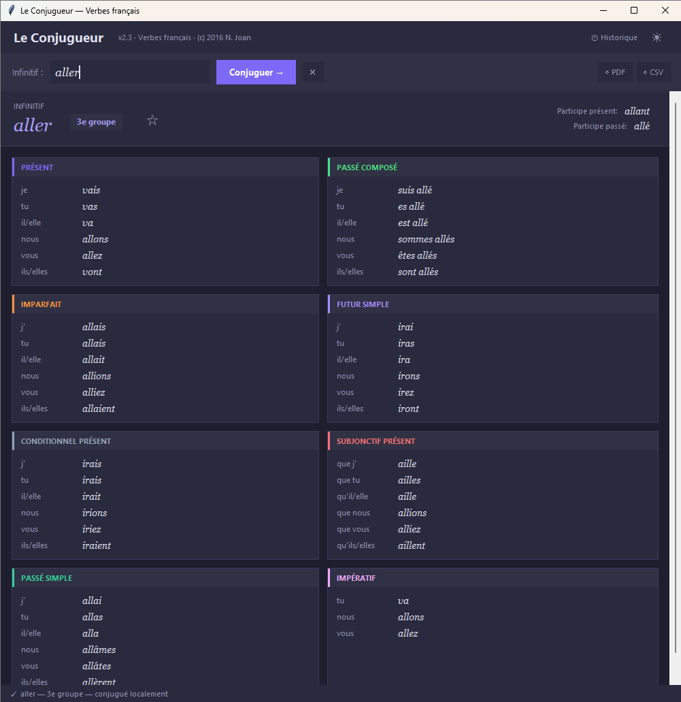

# 📚 Le Conjugueur

> Un conjugueur de verbes français moderne, 100 % hors-ligne, pour le bureau. 

  

### 🚀 Schnellstart (Windows EXE)

1. Unter **[Releases](../../releases)** die Datei `conjugueur.exe` herunterladen
2. Doppelklick — fertig, keine Installation nötig

## ✨ Présentation

**Le Conjugueur** conjugue n'importe quel verbe français — régulier ou irrégulier — sur 8 temps et modes, instantanément et entièrement hors-ligne. Tapez un verbe, appuyez sur Entrée, et obtenez un tableau de conjugaison complet et grammaticalement correct, avec autocomplétion, participes, détection du groupe, et gestion fine des élisions (*j'ai*, *j'irai*…).

Aucune clé API, aucune connexion internet, aucune dépendance cloud — tout tourne en local.

## 🧩 Fonctionnalités

- **8 temps et modes** : Présent, Passé composé, Imparfait, Futur simple, Conditionnel présent, Subjonctif présent, Passé simple, Impératif
- **Autocomplétion en direct** avec navigation au clavier
- **Grammaire correcte, pas d'approximation statistique** : moteur [`verbecc`](https://github.com/bretttolbert/verbecc), basé sur les données linguistiques *Verbiste* — accords corrects (auxiliaire avoir/être, genre/nombre) plutôt qu'un modèle qui devine
- **Élisions gérées correctement** : affiche "j'" au lieu de "je" quand le temps l'exige (*j'ai*, *j'irai*…), déterminé temps par temps — certains verbes irréguliers changent de radical selon le temps (ex. *aller* : "je vais" mais "j'irai")
- **Détection du groupe** (1er / 2e / 3e groupe) et participes présent/passé
- **Historique & favoris** : les derniers verbes consultés sont gardés en mémoire (persistant entre les sessions), et n'importe quel verbe peut être épinglé en favori (★) pour un accès rapide via le bouton "🕘 Historique"
- **Export CSV et PDF** du tableau de conjugaison affiché, en un clic
- **Thème clair / sombre**, basculable à tout moment (☀/🌙), préférence sauvegardée
- **Entièrement hors-ligne** — aucun appel réseau, aucune limite d'usage
- **Interface épurée**, cartes de temps colorées, mise en page redimensionnable avec défilement

### Historique, favoris, export et thème

- **★ Favori** : cliquez sur l'étoile à côté de l'infinitif pour épingler/désépingler le verbe
- **🕘 Historique** : ouvre un panneau listant vos favoris et vos verbes récents ; cliquez sur une entrée pour la recharger
- **⇩ CSV / ⇩ PDF** : exportent le tableau actuellement affiché
- **☀ / 🌙** : bascule entre thème clair et sombre

Ces préférences (thème, favoris, historique) sont sauvegardées automatiquement dans `~/.conjugueur/config.json` et restaurées au prochain lancement.

## 🗺️ Roadmap

- [ ] Export du tableau en DOCX
- [ ] Suppression d'entrées individuelles dans l'historique

## 📄 Licence

Distribué sous licence MIT. Voir [`LICENSE`](LICENSE) pour les détails.
